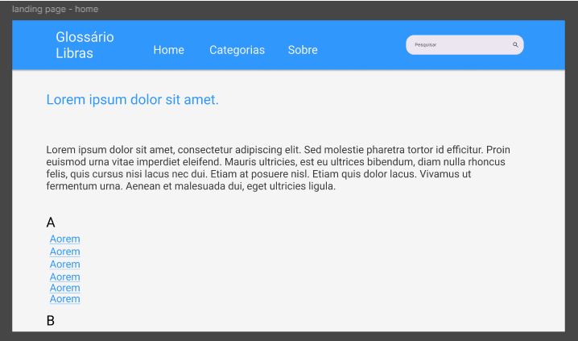
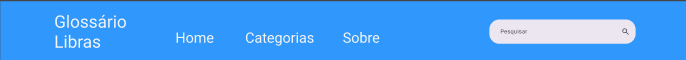
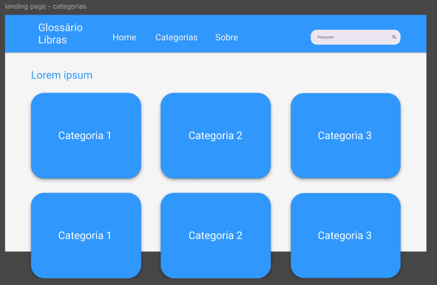
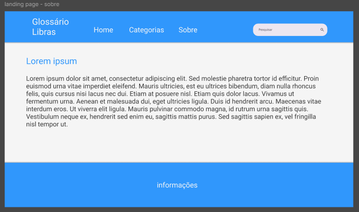
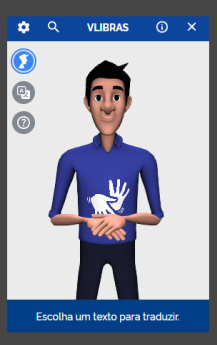

## Protótipo

O objetivo com o protótipo é apresentar uma versão preliminar do sistema
visando testar ideias e funcionalidades antes da produção final. O protótipo feito é um
de baixa fidelidade, uma representação simplificada e rápida, focando testar conceitos
iniciais de design sem se preocupar com detalhes visuais ou técnicos. Foi utilizado o
Figma para prototipação do projeto. 

### Protótipo - Home

A página “Home” do site seria a tela inicial, a primeira página acessada ao abrir
o site. Ainda estamos analisando qual será a melhor informação para a página, mas
inicialmente seria uma mensagem de introdução ao sistema e o índice das palavras
contidas no glossário.

### Protótipo - Header

O ”header” seria o mesmo para todas as páginas, nele contêm a logo do projeto,
que leva para a home ao clicado, a Home, Categorias, Sobre e uma barra de pesquisa
para o usuário procurar por um termo ou por uma categoria. 

### Protótipo - Categorias

A página "Categorias" organiza os sinais em grupos temáticos para facilitar a
navegação e o aprendizado. Ao acessar a página, o usuário encontra uma série de
ícones ou imagens representando diferentes categorias, como "Animais", "Alimentos",
"Saúde", "Tecnologia", "Educação", entre outras. Cada categoria é clicável e leva a
uma lista de sinais relacionados. Isso permite que usuários explorem facilmente o
glossário por áreas de interesse ou necessidade, promovendo um aprendizado mais
segmentado e organizado.

### Protótipo - Sobre

A página "Sobre" apresenta a missão e os objetivos do projeto, destacando seu
papel na promoção da inclusão e acessibilidade para a comunidade com deficiência
auditiva. Ela explica a importância de um glossário digital de sinais para facilitar a
comunicação entre surdos e ouvintes, além de apoiar o aprendizado da Língua
Brasileira de Sinais. Descreve a equipe responsável pelo projeto e inclui informações
sobre parcerias com instituições de ensino, organizações voltadas à acessibilidade, e
oferece links para recursos adicionais.

### Protótipo - Footer

O “Footer” ou “rodapé” irá incluir links para as redes sociais, dados de contato,
e informações sobre a equipe de desenvolvimento e sobre o projeto.

### Protótipo - VLibras

O VLibras é uma ferramenta que converte textos, áudios e vídeos em Língua
Brasileira de Sinais (Libras), facilitando o acesso à informação para pessoas surdas.
A implementação do VLibras no projeto ajudaria a tornar a plataforma mais inclusiva,
permitindo a tradução automática de conteúdos escritos em Libras, ampliando a
acessibilidade e o alcance do sistema para usuários surdos que preferem interagir
diretamente na língua de sinais.